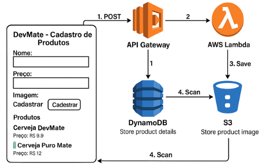

# 📦 Serverless Product API

API Serverless para cadastro de produtos com imagens, utilizando **AWS Lambda**, **API Gateway**, **DynamoDB** e **S3**, com automação completa via **Makefile** e **GitHub Actions**.

---

## 🧠 Visão Geral

Este projeto demonstra uma arquitetura moderna e escalável para microsserviços serverless. Ele abrange:

- Backend com Lambda Functions (Python)
- API REST com API Gateway
- Banco de dados NoSQL com DynamoDB
- Armazenamento de arquivos com S3 (público controlado)
- Deploy automatizado com Makefile
- Pipeline CI/CD usando GitHub Actions
- Frontend HTML simples embutido para testes rápidos

---

## ⚙️ Makefile (Automação Estilo DevMate)

| Comando             | Ação executada                                         |
|---------------------|--------------------------------------------------------|
| `make package`      | Empacota o código da função Lambda (.zip)              |
| `make upload`       | Cria bucket e envia o pacote para o S3                 |
| `make deploy`       | Realiza deploy da stack via CloudFormation             |
| `make test`         | Testa a API com chamada automática via `curl`          |
| `make destroy`      | Remove a stack, buckets e objetos                      |
| `make`              | Executa package, upload, deploy e test (pipeline local)|

---

## 🚀 CI/CD com GitHub Actions

### 🔐 Secrets Utilizados

- `AWS_ACCESS_KEY_ID`
- `AWS_SECRET_ACCESS_KEY`
- `AWS_REGION`

### 📦 Variáveis do Ambiente

- `STACK_NAME`, `BUCKET_NAME`, `ZIP_NAME`, `PROJECT_NAME`, `FUNCTION_DIR`, `TEMPLATE_PATH`

### 🔘 Execução Manual via Workflow Dispatch

A pipeline pode ser executada diretamente pela interface do GitHub:

**Inputs:**

| Input         | Descrição                                              |
|---------------|--------------------------------------------------------|
| `make_target` | Comando Make a ser executado (`all`, `deploy`, etc.)   |
| `DESTROY_AFTER` | `true` para destruir o ambiente ao final (opcional) |

---

## 🧪 Exemplo de Uso Interativo

```bash
# Faz deploy completo e destrói a stack após o teste
make DESTROY_AFTER=true
```

---

## 📸 Imagem da Interface



---

## 💡 Como isso ajuda DevOps Engineers?

- Demonstra habilidade com infraestrutura como código (IaC)
- Prova domínio da AWS em modelo pay-per-use (Lambda, API Gateway, DynamoDB, S3)
- Automatiza ciclo de vida completo com Make + GitHub Actions
- Facilita reusabilidade em ambientes de dev/test/produção

---

## 👤 Autor

Adriano Matildes — DevOps Engineer | GitOps | Cloud | IaC | Observability  
[LinkedIn](https://linkedin.com/in/adrianomatildes) • [GitHub](https://github.com/adrianomatildes)
